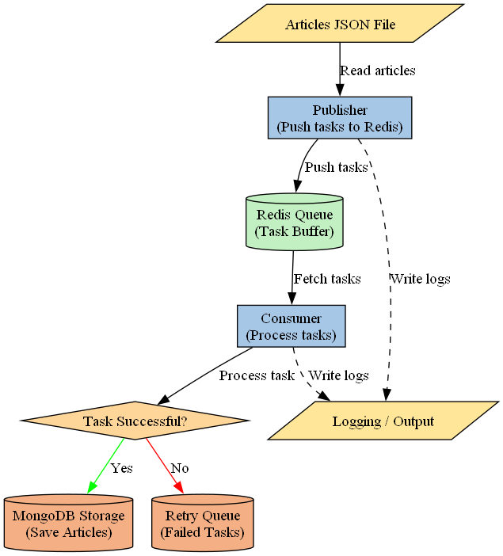

# 🚀 Publisher-Consumer Web Scraping Pipeline

A robust, scalable web scraping pipeline using Redis for task queuing and MongoDB for data storage. Built with Python and designed for Windows 11 with Docker support.

## 📋 Features

* **Publisher-Consumer Architecture**: Scalable task distribution using Redis
* **Web Scraping**: Intelligent content extraction with retry mechanisms
* **Data Storage**: MongoDB with automatic indexing and duplicate prevention
* **Docker Support**: Easy deployment with docker-compose
* **CLI Interface**: Single entry point for all operations
* **MVC Architecture**: Clean separation of concerns
* **Environment Configuration**: All settings via .env file
* **Graceful Shutdown**: Proper signal handling
* **Comprehensive Logging**: Detailed operation tracking

## 🏗️ Architecture



## 🛠️ Installation

### Prerequisites

* Python 3.8+
* Docker Desktop (for Windows 11)
* Git

### Step 1: Clone and Setup

```cmd
# Clone the repository
git clone <your-repo-url>
cd publisher-consumer-pipeline

# Create virtual environment
python -m venv venv

# Activate virtual environment (Windows)
venv\Scripts\activate

# Install dependencies
pip install -r requirements.txt
```

### Step 2: Create a `.env` File

> **Important:** `.env` is **not included** in the repository.
> You need to create it manually in the project root.

Create a file named `.env` with the following content:

```env
# Redis Configuration
REDIS_HOST=localhost
REDIS_PORT=6379
REDIS_DB=0
REDIS_QUEUE_NAME=articles_queue

# MongoDB Configuration
MONGO_USERNAME=admin
MONGO_PASSWORD=password123
MONGO_DATABASE=articles_db
MONGO_PORT=27017

# Scraping Configuration
SCRAPER_TIMEOUT=30
SCRAPER_MAX_RETRIES=3
SCRAPER_DELAY=1.0

# Logging
LOG_LEVEL=INFO
```

Edit credentials or ports as needed for your environment.

### Step 3: Start Docker Services

```cmd
# Start Redis and MongoDB with Docker
docker-compose up -d

# Verify services are running
docker-compose ps
```

### Step 4: Run Publisher & Consumer

Open **two terminals**:

**Terminal 1 – Consumer:**

```cmd
python main.py --mode consumer
```

**Terminal 2 – Publisher:**

```cmd
python main.py --mode publisher --file articles.json
```

> ✅ The consumer will process tasks as the publisher pushes them to Redis.

### Step 5: Stop Services

```cmd
# Stop all Docker services
docker-compose down

# Reset all data (optional)
docker-compose down -v
```

---

## 🚀 Usage

### Basic Commands

```cmd
# Test connections
python main.py --mode test

# Publish articles to queue
python main.py --mode publisher --file articles.json

# Start consumer (runs until Ctrl+C)
python main.py --mode consumer

# Run both publisher and consumer
python main.py --mode both --file articles.json

# Enable verbose logging
python main.py --mode consumer --verbose
```

### Custom JSON File

Create your own articles file:

```json
[
  {
    "id": "my_article_1",
    "url": "https://example.com/article1",
    "source": "example.com",
    "category": "news",
    "priority": "high"
  }
]
```

Then publish it:

```cmd
python main.py --mode publisher --file my_articles.json
```

---

## 📁 Project Structure

```
publisher-consumer-pipeline/
│
├── core/                   # Core business logic
│   ├── __init__.py
│   ├── publisher.py        # Task publishing logic
│   ├── consumer.py         # Task processing logic
│   ├── redis_handler.py    # Redis queue operations
│   ├── db_handler.py       # MongoDB operations
│   └── scraper.py          # Web scraping logic
│
├── models/                 # Data models
│   ├── __init__.py
│   └── article.py          # Article and task models
│
├── config/                 # Configuration
│   ├── __init__.py
│   └── settings.py         # Settings management
│
├── utils/                  # Utilities
│   ├── __init__.py
│   └── logger.py           # Logging setup
│
├── venv/                   # Virtual environment
├── articles.json           # Sample data
├── test_pipeline.py        # Test runner
├── .env                    # Environment variables
├── requirements.txt        # Dependencies
├── docker-compose.yml      # Docker services
└── README.md               # This file
```

---

## ⚙️ Configuration

All settings are in the `.env` file.

* Redis: host, port, DB, queue name
* MongoDB: username, password, database, port
* Scraper: timeout, retries, delay
* Logging level

---

## 🐳 Docker Commands

```cmd
# Start services
docker-compose up -d

# View logs
docker-compose logs -f

# Stop services
docker-compose down

# Reset data (removes volumes)
docker-compose down -v
```

---


### Logs and Debugging

```cmd
python main.py --mode consumer --verbose
docker-compose logs mongodb
docker-compose logs redis
```

---


"# Publisher-Consumer-Web-Scraping-Pipeline" 
